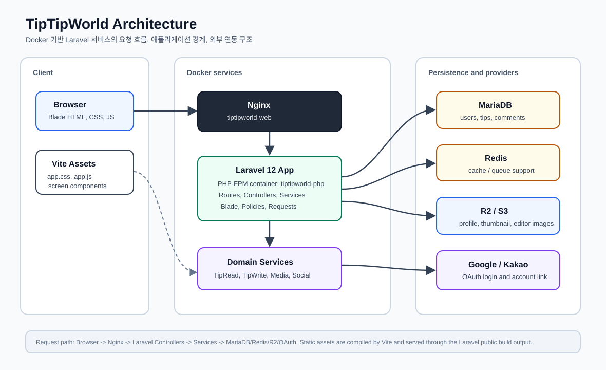
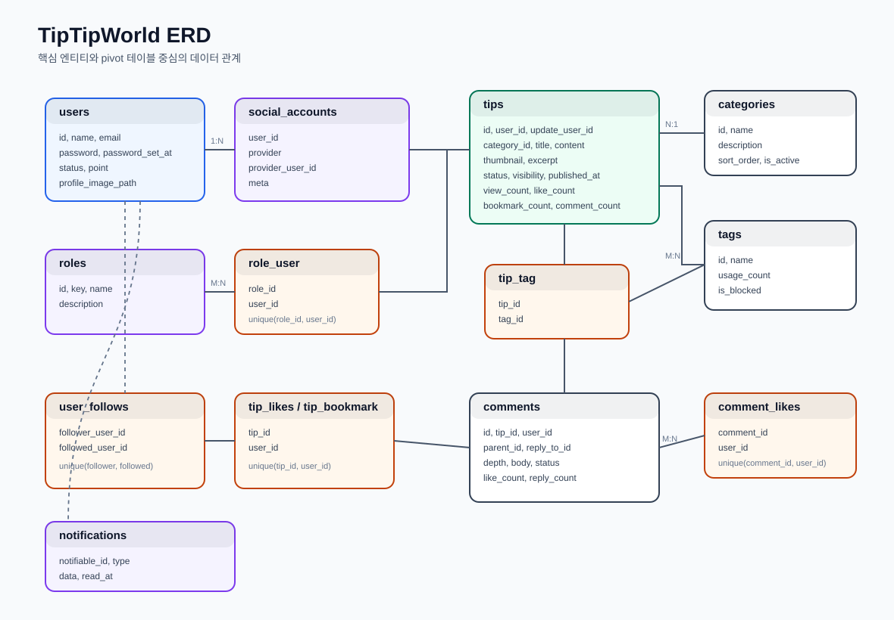

# TipTipWorld

TipTipWorld는 생활 팁과 노하우를 작성, 탐색, 저장, 공유할 수 있는 Laravel 기반 웹 애플리케이션이다. 공개 사용자는 홈, 검색, 카테고리/태그 목록, 사용자 피드를 통해 공개 팁을 탐색할 수 있고, 로그인 사용자는 팁 작성, 댓글, 좋아요, 북마크, 팔로우, 알림, 마이페이지 기능을 사용할 수 있다.

관리자는 별도 관리자 화면에서 사용자, 카테고리, 태그, 팁 목록을 관리한다. 이미지 업로드는 Cloudflare R2 같은 S3 호환 스토리지를 전제로 구성되어 있고, Google/Kakao 소셜 로그인도 지원한다.

## 프로젝트 정보

- 프로젝트 유형: Laravel 12 기반 팁 공유 서비스
- 주요 사용자: 공개 방문자, 로그인 회원, 관리자
- 주요 목적: 팁 작성/탐색/반응/저장/팔로우 기능을 갖춘 커뮤니티형 서비스 구현
- 앱 위치: `src/`
- 인프라 위치: 루트 `docker-compose.yml`, `docker/`
- 로컬 웹 서버: Nginx + PHP-FPM
- 데이터 저장소: MariaDB, Redis, Laravel database notification, R2/S3 호환 이미지 스토리지

## 주요 기능

- 홈: 인기 팁, 인기 태그, 카테고리, 집계 통계 제공
- 팁 탐색: 상세 보기, 검색, 카테고리/태그별 목록, 사용자 피드
- 팁 관리: 작성, 수정, 삭제, 썸네일, 본문 이미지, 태그 동기화
- 반응: 좋아요, 북마크, 댓글, 답글, 댓글 좋아요
- 사용자 관계: 팔로우/팔로잉 목록, 사용자 피드
- 마이페이지: 프로필, 내 팁, 보관함, 알림
- 인증: 이메일/비밀번호, Google/Kakao 소셜 로그인, 소셜 계정 연결/해제
- 관리자: 사용자, 카테고리, 태그, 팁 관리
- SEO/공유: 공개 팁 상세의 canonical, Open Graph, Twitter card, robots 메타 처리

## 기술 스택

| 영역 | 기술 |
| --- | --- |
| Backend | PHP 8.4, Laravel 12, Laravel Breeze, Laravel Socialite |
| Frontend | Blade, Tailwind CSS, Alpine.js, jQuery, Vite |
| Editor | Summernote, Tiptap |
| Database/Cache | MariaDB, Redis, SQLite in-memory 테스트 DB |
| Storage | Laravel Filesystem, S3 호환 R2 disk |
| Test/Quality | Pest, PHPUnit, Laravel Pint |
| Infra | Docker Compose, Nginx, PHP-FPM |

## 아키텍처



## 화면과 주요 URL

| 구분 | URL | 담당 코드 |
| --- | --- | --- |
| 홈 | `/` | `HomeController@index`, `home/home.blade.php` |
| 팁 상세 | `/tip/{tip_id}` | `TipBrowseController@showPost`, `tips/partials/detail.blade.php` |
| 검색 | `/tips/search` | `TipBrowseController@tipSearch`, `tips/partials/tipsearch.blade.php` |
| 카테고리/태그 목록 | `/tips/category/{id}`, `/tips/tag/{id}` | `TipBrowseController@tipListBySort` |
| 사용자 피드 | `/tips/user/{user_id}` | `TipBrowseController@tipUserFeed`, `tips/partials/userfeed.blade.php` |
| 팁 작성/수정 | `/tips/form/{tip?}` | `TipManageController@formFront`, `tips/partials/tipform.blade.php` |
| 마이페이지 | `/mypage/{tab?}` | `MyPageController@index`, `mypage/partials/*` |
| 관리자 | `/admin/{tab?}` | `Admin\DashboardController@index`, `admin/partials/*` |
| 소셜 로그인 | `/auth/{provider}` | `SocialLoginController`, `SocialAuthService` |

## 디렉토리 구조

```text
.
├── docker/                  # Nginx/PHP 컨테이너 설정
├── docker-compose.yml        # app, web, db, redis 스택
├── README.md
└── src/
    ├── app/
    │   ├── Http/Controllers  # 화면/요청 진입점
    │   ├── Http/Requests     # Form Request 검증/권한
    │   ├── Models            # Eloquent 모델
    │   ├── Policies          # 권한 정책
    │   ├── Services          # 도메인/미디어/소셜/알림 서비스
    │   └── Support           # Presenter 등 표시용 지원 코드
    ├── config/               # Laravel 및 서비스 설정
    ├── database/             # migration, seeder, factory
    ├── resources/
    │   ├── css               # Tailwind 및 화면별 CSS
    │   ├── js                # Vite 엔트리와 화면별 JS
    │   └── views             # Blade layout, component, partial
    ├── routes/               # web/auth/console route
    └── tests/                # Pest Feature/Unit 테스트
```

## 데이터 모델 다이어그램



# 시작 가이드

## 요구 사항

- Docker, Docker Compose
- 루트 `.env`의 MariaDB 관련 값
- `src/.env`의 Laravel 앱 설정
- 이미지 업로드를 사용할 경우 R2/S3 호환 스토리지 설정
- 소셜 로그인을 사용할 경우 Google/Kakao OAuth client 설정

## 서버 세팅

```bash
cd tiptipworld
touch .env
# .env 파일, default.conf 파일 수정

docker compose build --no-cache
docker compose up -d

```

## 라라벨 세팅

```bash
cd src
vi .env
docker compose exec -u root app composer install
sudo chown -R devl333:devl333 vendor
chmod -R 775 storage bootstrap/cache
su devl333
sudo chown -R devl333:devl333 .
chmod 664 .env
chmod -R 777 storage bootstrap/cache
docker compose exec -u root app php artisan key:generate

cd ~/infrastructure/services/tiptipworld/src
docker compose exec -u root app npm install
docker compose exec -u root app npm run build
sudo chown -R devl333:devl333 node_modules public/build

docker compose exec app php artisan migrate


```

# 상세 코드 분석

이 분석은 현재 체크아웃의 직접 관리 코드 기준이다. `vendor/`, `node_modules/`, `public/build` 같은 외부 의존성/빌드 산출물은 제외하고, Laravel 애플리케이션 코드, Blade, JS/CSS, Docker 설정, 테스트를 중심으로 확인했다.

## 한 줄 요약

TipTipWorld는 Laravel 12 기반의 팁 공유 서비스다. 공개 화면은 홈, 팁 상세, 검색, 카테고리/태그 목록, 사용자 피드로 구성되고, 인증 사용자는 팁 작성/수정/삭제, 댓글, 좋아요, 북마크, 팔로우, 마이페이지, 알림을 사용한다. 관리자는 사용자, 카테고리, 태그, 팁을 탭 기반 관리자 화면에서 관리한다.

## 실행 환경과 의존성

- 루트 `docker-compose.yml`은 PHP-FPM 앱, Nginx 웹 서버, MariaDB, Redis를 구성한다. 앱 컨테이너는 `./src`를 `/var/www/html`로 마운트하고 Vite 포트 `5174:5173`을 연다.
- PHP 이미지는 `docker/php/Dockerfile`에서 PHP 8.4 FPM, `pdo_mysql`, `gd`, `zip`, `bcmath`, `redis`, `xdebug`, Node.js 22, Composer를 설치한다.
- Laravel 의존성은 `src/composer.json` 기준 Laravel 12, Socialite, Kakao Socialite provider, S3 호환 Flysystem, Pest, Pint, Breeze를 사용한다.
- 프론트엔드는 `src/package.json` 기준 Vite, Tailwind, Alpine, Axios, jQuery, Summernote, Tiptap으로 구성된다.
- 외부 설정은 `src/config/filesystems.php`, `src/config/services.php`, `src/config/social-auth.php`에 모여 있다. R2는 `r2` disk로 정의되어 있고 Google/Kakao OAuth는 Socialite 설정을 사용한다.

## 주요 라우트 구조

- `src/routes/web.php`는 서비스의 대부분의 화면과 JSON 액션을 담당한다.
- `/`는 `HomeController@index`로 홈 화면을 렌더링한다.
- `/tip/{tip_id}`, `/tips/search`, `/tips/category/{category_id}`, `/tips/tag/{tag_id}`, `/tips/user/{user_id}`는 `TipBrowseController`가 담당한다.
- `/tips`, `/tips/{tip}`, `/tips/form/{tip?}`는 `TipManageController`가 작성/수정/삭제 흐름을 담당한다.
- `/tip/like/{tip_id}`, `/tip/bookmark/{tip_id}`는 `TipReactionController`가 JSON 토글 응답을 반환한다.
- `/tip/comment...` 계열은 `CommentController`가 댓글 목록, 등록, 수정, 삭제, 좋아요를 처리한다.
- `/user/follow/{user_id}`, `/user/follows/{user_id}`는 팔로우 토글과 팔로우 목록 JSON API다.
- `/mypage/{tab?}`는 `MyPageController`가 프로필, 내 팁, 보관함, 알림 탭을 전환한다.
- `/admin/{tab?}`와 `/admin/...` 액션은 `admin`, `auth` 미들웨어 뒤에서 관리자 탭과 저장 액션을 처리한다.
- `src/routes/auth.php`는 Breeze 인증 라우트에 Google/Kakao 소셜 로그인 및 콜백 라우트를 추가한다.

## 핵심 도메인 흐름

### 팁 조회

팁 읽기 흐름의 중심은 `src/app/Services/Tip/TipReadService.php`다. 컨트롤러는 화면 컨텍스트와 필터만 넘기고, 서비스가 쿼리 생성, 필터 적용, 정렬, 페이지네이션/컬렉션 조회, Presenter 변환, 화면 payload 조립을 수행한다.

`src/config/tip_lists.php`는 조회 컨텍스트를 설정으로 분리한다. 현재 컨텍스트는 `public_search`, `category`, `tag`, `user_feed`, `my_tips`, `admin_tips`, `home_popular`이다. 각 컨텍스트는 `query_method`, `presenter`, `result_mode`, `meta_profile`을 지정한다.

`src/app/Support/Tip/TipPresenter.php`는 Eloquent 모델을 Blade가 바로 쓰는 배열로 바꾼다. 카드, 목록 아이템, 작성자 행, 관리자 행, 상세, 보관함 아이템을 각각 다른 shape로 반환하며, 상세 화면에서는 공유/SEO 메타까지 함께 만든다.

### 팁 작성, 수정, 삭제

`TipManageController`는 화면 진입과 redirect만 조율하고 실제 저장 로직은 `src/app/Services/TipWriteService.php`에 위임한다. 입력 검증과 권한은 `StoreTipRequest`, `UpdateTipRequest`, `DestroyTipRequest`, `TipPolicy`가 앞단에서 처리한다.

`TipWriteService`는 DB transaction 안에서 Tip 레코드, 태그 동기화, 썸네일 경로 반영을 처리하고, commit 이후에는 에디터 draft 이미지 이동, 제거된 본문 이미지 삭제, 이전 썸네일 정리를 수행한다. 실패 시 새로 저장된 파일을 보정 삭제하는 방어 코드가 있다.

태그 처리는 `src/app/Services/Tip/TipTagService.php`가 담당한다. JSON 문자열로 들어온 태그를 정리하고, 차단 태그는 제외하며, 차단 태그가 있으면 사용자에게 보여줄 경고 문구를 반환한다.

### 댓글, 반응, 팔로우, 알림

`CommentController`는 댓글을 2단계 구조로 제한한다. 원댓글은 `depth=0`, 답글은 `depth=1`이고, 실제 답글 대상은 `reply_to_id`로 보관한다. 삭제는 물리 삭제가 아니라 `status=deleted`와 고정 문구 마스킹으로 처리한다.

`TipReactionController`는 좋아요와 북마크를 `toggle()`로 처리하고, 최종 수치를 `tips.like_count`, `tips.bookmark_count` 캐시 컬럼에 다시 반영한다. 새 반응이 추가된 경우에만 알림을 생성한다.

`FollowService`는 팔로우 여부, 팔로우 토글, 팔로워/팔로잉 목록 조회를 담당한다. 사용자 피드의 팔로우 모달은 이 JSON 응답을 사용한다.

`UserNotificationService`는 댓글, 답글, 좋아요, 북마크, 팔로우 알림을 database notification으로 만든다. 자기 자신에게 보내는 알림은 생성하지 않으며, 마이페이지 알림 탭에서는 읽음/안읽음과 유형 필터를 제공한다.

## 데이터 모델

- `users`: 기본 인증 사용자이며 `roles`, `socialAccounts`, `tips`, `likedTips`, `bookmarkedTips`, `comments`, `followingUsers`, `followerUsers` 관계를 가진다. `isAdmin()`은 `role_user`의 `admin` role 기준이다.
- `roles`, `role_user`: 관리자, 에디터, 모더레이터 같은 권한을 다대다로 표현한다.
- `social_accounts`: provider와 provider 사용자 ID를 사용자와 연결한다. provider별 token 메타는 JSON으로 저장한다.
- `tips`: 제목, 본문, 요약, 썸네일, 상태, 공개 범위, 게시일, 조회/좋아요/북마크/댓글 캐시를 가진 핵심 게시글 모델이다.
- `categories`: 활성 상태와 정렬 순서를 가진다. 홈/검색/작성 폼/관리자에서 재사용된다.
- `tags`, `tip_tag`: 팁과 태그의 다대다 관계다. `is_blocked` 태그는 공개 표시 및 저장 동기화에서 제외된다.
- `tip_likes`, `tip_bookmark`: 사용자별 팁 반응 pivot이다.
- `comments`, `comment_likes`: 댓글/답글과 댓글 좋아요를 저장한다.
- `user_follows`: follower/followed 사용자 관계를 저장한다.
- `notifications`: Laravel database notification 테이블이다.
- `cache`, `jobs`, `sessions`: Laravel 기본 cache, queue, session 저장소다.

## 화면 구조

공개 화면은 `src/resources/views/layouts/community.blade.php`가 기본 레이아웃이다. 홈은 `home/home.blade.php`에서 인기 팁, 인기 태그, 전체 카테고리 컴포넌트를 조립한다.

팁 관련 화면은 `src/resources/views/tips/view.blade.php`가 공통 진입점이다. `viewMode` 값에 따라 상세, 검색, 카테고리/태그 목록, 사용자 피드, 작성 폼 partial을 선택한다.

마이페이지는 `mypage/dashboard.blade.php`가 공통 레이아웃이고, `config/mypage.php`의 탭 이름에 맞춰 `mypage/partials/{tab}.blade.php`를 include한다.

관리자 화면은 `admin/dashboard.blade.php`가 공통 레이아웃이고, `config/admin.php`의 `users`, `categories`, `tags`, `tips` 탭에 맞춰 partial을 include한다.

SEO/공유 메타는 `components/seo-meta.blade.php`가 공통 출력 담당이다. `layouts/app.blade.php`와 `layouts/community.blade.php`는 이 컴포넌트를 포함하고, `tips/view.blade.php`는 상세 화면에서 `TipPresenter`가 만든 `seo` 배열을 section/stack으로 전달한다. `layouts/guest.blade.php`는 현재 공통 SEO 컴포넌트를 포함하지 않는다.

## 프론트엔드 자산

`src/vite.config.js`는 `resources/css/app.css`, `resources/js/app.js`와 화면별 JS 컴포넌트를 개별 엔트리로 등록한다.

`resources/js/app.js`는 Alpine만 부트스트랩한다. 화면별 동작은 별도 파일로 분리되어 있다.

- `tip-actions.js`: 좋아요, 북마크, 공유 버튼 처리
- `tip-comments.js`: 댓글 목록 로딩, 등록, 답글, 수정, 삭제, 댓글 좋아요 처리
- `tip-reaction-modal.js`: 상세 화면 좋아요/북마크 사용자 모달
- `userfeed.js`: 사용자 피드 정렬, 팔로워/팔로잉 모달, 팔로우 토글
- `profile.js`: 작성자 inline 영역 팔로우 UI 갱신
- `summernote.js`: 에디터 이미지 업로드
- `tiptap-editor.js`: Tiptap 에디터 마운트와 toolbar 동작

CSS는 `resources/css/app.css`가 page/component CSS를 import한 뒤 Tailwind layer를 로드한다. 주요 화면 스타일은 `pages/home-shell.css`, `pages/tip-detail-wireframe.css`, `pages/tip-list-wireframe.css`, `pages/tip-search-wireframe.css`, `pages/tip-userfeed.css`, `pages/mypage-*.css`에 나뉘어 있다.

## 인증과 소셜 로그인

기본 이메일/비밀번호 인증은 Laravel Breeze 흐름을 따른다. `SocialLoginController`, `SocialAuthService`, `SocialProviderRegistry`, `SocialAccountRevoker`가 Google/Kakao 소셜 로그인을 확장한다.

소셜 로그인 정책은 `config/social-auth.php`에 provider별로 모여 있다. Google은 이메일 인증을 신뢰하고, Kakao는 이메일 인증을 자동 확정하지 않는다. 같은 이메일의 기존 계정이 있으면 자동 연결하지 않고 기존 로그인 방식을 요구한다.

로그인 중인 사용자는 프로필 화면에서 소셜 계정을 연결하거나 해제할 수 있다. 마지막 소셜 연결을 해제하려는 경우 로컬 비밀번호 로그인 수단이 없으면 차단한다. 계정 삭제 시 소셜 계정 revoke를 시도하고, 프로필 이미지를 정리한 뒤 사용자 레코드를 삭제한다.

## 미디어와 스토리지

이미지 저장의 중심은 `R2ImageStorageService`다. 업로드 이미지 MIME을 확인하고, UUID 기반 파일명을 만들고, `r2` disk에 public visibility와 장기 cache header로 저장한다. 외부 URL 이미지 import, 내부 경로 이동, 파일 목록 조회, 삭제, URL 변환도 여기에서 담당한다.

용도별 서비스는 다음처럼 분리된다.

- `ProfileImageService`: 사용자 프로필 이미지 교체, 외부 아바타 import, 삭제
- `TipThumbnailService`: 팁 썸네일 저장, 삭제, fallback URL
- `EditorImageService`: 본문 에디터 이미지 업로드, draft 이미지를 게시글 경로로 이동, 수정 후 제거된 이미지 삭제, 게시글 삭제 후 전체 이미지 삭제
- `MediaPath`: `media/users/{id}/profile`, `media/posts/{id}/editor`, `media/posts/drafts/{userId}/{draftKey}/editor`, `media/posts/{id}/thumbnails` 경로 생성

운영 환경에서 이미지 기능을 사용하려면 `FILESYSTEM_DISK`, `R2_ACCESS_KEY_ID`, `R2_SECRET_ACCESS_KEY`, `R2_REGION`, `R2_BUCKET`, `R2_ENDPOINT`, `R2_URL`, `R2_USE_PATH_STYLE_ENDPOINT` 설정을 확인해야 한다.

## 테스트 현황

테스트는 Pest를 사용한다. Feature 테스트는 `tests/Feature`, Unit 테스트는 `tests/Unit`에 있다. `phpunit.xml`은 테스트 환경에서 SQLite in-memory, array cache/session, sync queue를 사용한다.

현재 주요 커버리지는 다음과 같다.

- 인증 기본 흐름: 로그인, 회원가입, 비밀번호 재설정, 이메일 인증
- 프로필: 정보 수정, 계정 삭제, 소셜 사용자 삭제/실패 케이스 일부
- 팁 CRUD: FormRequest/Policy 통과 후 `TipWriteService` 호출 shape, 비소유자 수정 차단, 삭제 redirect
- SEO/공유 메타: 공개 팁 index/follow, 비공개/임시글 noindex
- 홈: 공개/게시 팁 기준 인기 태그와 hero 통계
- Summernote 업로드: 인증 사용자 이미지 업로드 응답 shape
- 미디어 서비스: R2 저장/삭제/이동, 프로필/썸네일/에디터 이미지 경로와 권한
- 소셜 로그인: 신규 Google 가입, 기존 이메일 충돌, 다른 provider 계정 충돌
- 날짜 필터: 관리자 팁 날짜 범위 스코프의 end-of-day 처리

댓글, 팔로우, 알림, 관리자 카테고리/태그/사용자 수정, 사용자 피드 모달 같은 상호작용은 코드가 존재하지만 자동 테스트 커버리지는 상대적으로 얇다. 이 영역을 변경할 때는 Feature 테스트나 브라우저 확인을 추가하는 편이 안전하다.

## 읽기 순서

처음 코드를 읽는다면 아래 순서가 가장 빠르다.

1. `src/routes/web.php`, `src/routes/auth.php`
2. `src/app/Http/Controllers/HomeController.php`, `TipBrowseController.php`, `TipManageController.php`
3. `src/config/tip_lists.php`
4. `src/app/Services/Tip/TipReadService.php`, `src/app/Support/Tip/TipPresenter.php`
5. `src/app/Services/TipWriteService.php`, `src/app/Http/Requests/TipRequest.php`, `src/app/Policies/TipPolicy.php`
6. `src/app/Models/Tip.php`, `User.php`, `Comment.php`, `Tag.php`, `Category.php`
7. `src/resources/views/tips/view.blade.php`와 `src/resources/views/tips/partials/*`
8. `src/resources/js/components/tip-actions.js`, `tip-comments.js`, `userfeed.js`
9. `src/tests/Feature/TipCrudTest.php`, `src/tests/Unit/MediaServiceTest.php`

## 변경 시 주의할 점

- 팁 목록/상세 화면은 `TipReadService`와 `TipPresenter`의 데이터 shape에 Blade가 강하게 의존한다. 필드명을 바꾸면 뷰와 JS까지 함께 확인해야 한다.
- 좋아요, 북마크, 댓글 수는 pivot/count 결과만이 아니라 `tips.*_count` 캐시 컬럼에도 반영된다. 반응 로직을 바꾸면 캐시 컬럼 동기화도 같이 봐야 한다.
- 팁 공개 여부는 `status=published`와 `visibility=public` 조합이 공개 노출 기준이다. 상세 접근, 홈, 검색, 카테고리/태그 목록, 사용자 피드 통계가 이 기준을 공유한다.
- 에디터 이미지는 작성 중 draft 경로에 저장되고 저장 후 게시글 경로로 이동된다. `editor_draft_key` 검증, R2 이동 실패, 본문 URL 치환 실패가 실제 사용자 데이터에 영향을 줄 수 있다.
- Socialite 토큰은 `social_accounts.meta`에 저장된다. 로그나 README, 작업 로그에 token/secret 실제 값을 남기면 안 된다.
- 관리자 화면은 세션에 탭별 query string을 저장해 수정 후 목록 필터를 복원한다. redirect 변경 시 `session('*.query')` 사용 여부를 확인해야 한다.
- `layouts/guest.blade.php`는 현재 공통 SEO 컴포넌트를 포함하지 않는다. 로그인/회원가입 같은 guest 화면까지 SEO 정책을 통일하려면 이 레이아웃도 별도 확인이 필요하다.
- 현재 코드에는 일부 중복/오타성 표현이 보인다. 예를 들어 `TipReadService::contextConfig()`의 중복 `return`, `TipPresenter`의 중복 배열 키, 주석 오타는 동작에는 큰 영향이 없지만 리팩토링 시 정리 후보로 볼 수 있다.
