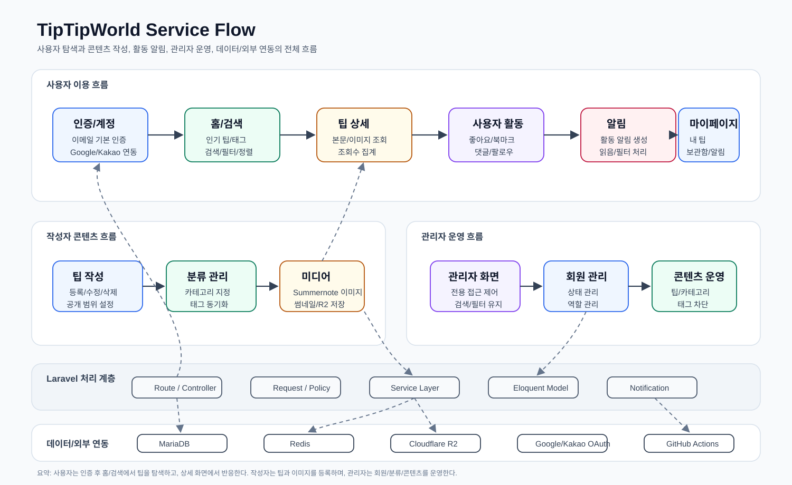

# TipTipWorld

TipTipWorld는 Laravel 12 기반의 팁 공유 커뮤니티 애플리케이션임. Docker Compose로 PHP-FPM, Nginx, MariaDB, Redis를 함께 실행하며, Laravel Breeze 인증, 소셜 로그인, 팁 작성/검색/댓글/좋아요/북마크/팔로우, 관리자 기능을 포함함.

## 시스템 구조

## 문서 안내

| 분류 | 주요 내용 | 상세 문서 |
| --- | --- | --- |
| 설치 전 준비 | Docker, 로컬 도메인, 루트 및 Laravel 환경변수, 권한 준비 | [docs/prerequisites.md](docs/prerequisites.md) |
| 최초 설치 | Docker 빌드/실행, Composer/NPM 설치, 앱 키 생성, 빌드, 마이그레이션 | [docs/installation.md](docs/installation.md) |
| 시스템 구조 | 요청 흐름, 컨테이너 네트워크, Laravel 처리 계층 | [docs/architecture.md](docs/architecture.md) |
| 서비스 | Docker Compose 서비스 목록, 포트, 볼륨, 서비스별 문서 링크 | [docs/services.md](docs/services.md) |
| 기능 | 인증, 팁 탐색/작성, 댓글/반응, 팔로우, 마이페이지, 관리자, 이미지 업로드 | [docs/features/README.md](docs/features/README.md) |
| 운영 | 상태 확인, 로그, 캐시/큐/마이그레이션 운영 명령 | [docs/operations.md](docs/operations.md) |
| 보안 | secret 관리, env 설정, 파일 권한, 업로드/스토리지, 소셜 로그인 주의사항 | [docs/security.md](docs/security.md) |
