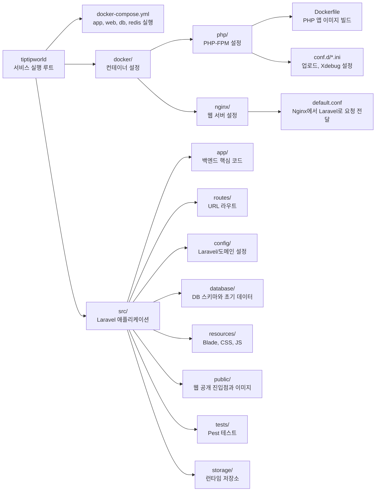
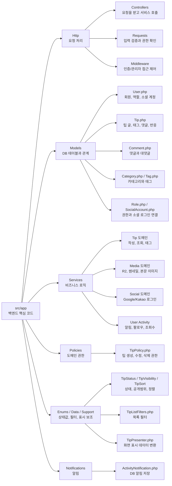
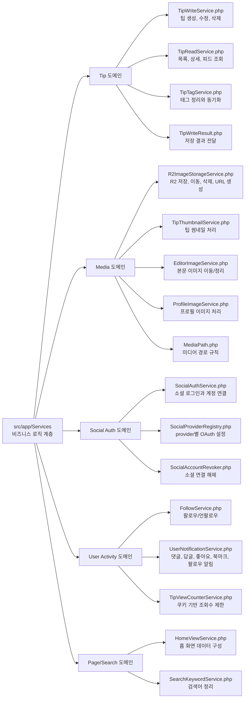
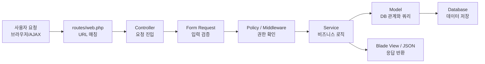

# 애플리케이션 구조

[README로 돌아가기](../README.md)

Laravel 애플리케이션 코드는 `src/` 아래에 둠.

## 요청 처리 구조

Laravel 라우터는 `src/routes/web.php`와 `src/routes/auth.php`의 정의에 따라 컨트롤러를 호출함. 컨트롤러는 모델, 서비스, Form Request, Policy, Blade 뷰와 협력해 응답을 생성함.

데이터는 MariaDB, Laravel storage, 필요한 경우 Redis 또는 외부 S3/R2 호환 스토리지에 저장됨.

## 구조 다이어그램

문서, CI, AI 작업 보조 파일을 제외하고 실제 애플리케이션 실행과 기능에 직접 관여하는 구조만 표시함.

### 실행 구조

### 백엔드 핵심 구조

### 서비스 계층 구조

### 요청 처리 흐름

## 디렉터리 구조

| 경로 | 역할 |
| --- | --- |
| `src/app/Http/Controllers` | 화면/액션 컨트롤러 |
| `src/app/Http/Requests` | 요청 검증 |
| `src/app/Models` | Eloquent 모델 |
| `src/app/Services` | 팁, 홈 화면, 팔로우, 알림, 파일 저장, 소셜 계정 해제 등 재사용 로직 |
| `src/app/Policies` | 사용자 권한 정책 |
| `src/resources/views` | Blade 화면과 컴포넌트 |
| `src/resources/css`, `src/resources/js` | Vite로 빌드되는 프론트엔드 자산 |
| `src/routes/web.php` | 공개 화면, 인증 사용자 기능, 관리자 기능 라우트 |
| `src/routes/auth.php` | Breeze 인증, Google/Kakao 소셜 로그인 라우트 |
| `src/config` | Laravel 설정 |
| `src/database/migrations` | 데이터베이스 스키마 |
| `src/tests` | Pest 테스트 |

Vite는 `src/resources/css`와 `src/resources/js` 자산을 `src/public/build`로 빌드함. 주요 프론트엔드 의존성은 Tailwind CSS, Alpine.js, Axios, Tiptap, jQuery, Summernote임.
