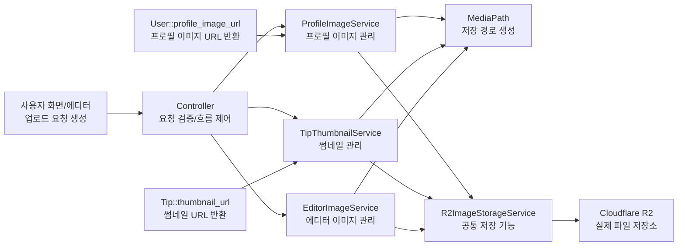
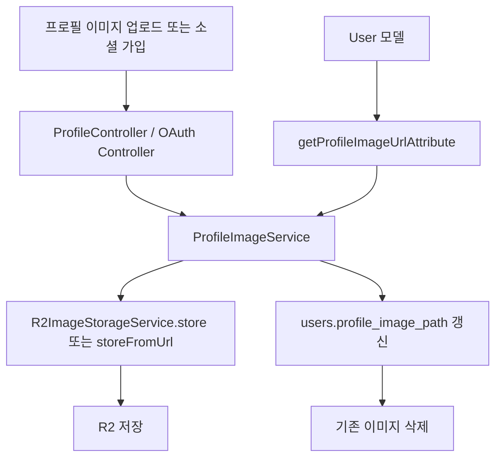
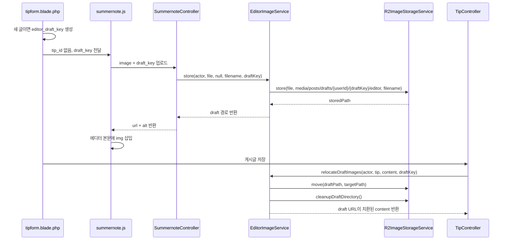

# 이미지 관리 구조 정리

## 주제
Cloudflare R2 기반 이미지 관리 구조 설계 및 구현

## 한 줄 요약
프로필 이미지, 게시글 썸네일, 에디터 본문 이미지를 하나의 공통 저장 레이어 위에 올리고, 반복되는 저장 기능은 묶어 중복을 줄이면서 이미지 종류별 비즈니스 로직은 별도 서비스로 분리해 관리했다.

## 문제 정의
이 프로젝트의 이미지는 한 종류가 아니다. 프로필 이미지는 교체와 삭제가 중요하고, 게시글 썸네일은 게시글 저장 흐름과 함께 움직여야 하며, 에디터 이미지는 임시 업로드, 게시 후 이동, 수정 시 정리까지 필요하다. 즉, 단순 업로드 기능이 아니라 이미지 종류별 라이프사이클을 관리해야 하는 문제였다.

여기에 반대되는 두 요구가 동시에 있었다.

1. 이미지 종류마다 생성 시점, 저장 위치, 정리 방식은 달라야 한다.
2. 업로드, URL 변환, 삭제, 이동 같은 반복 기능은 중복 구현하고 싶지 않다.

그래서 이 구조는 "공통 기능은 한 곳에 모으고, 도메인 규칙은 이미지 종류별로 분리한다"는 방향으로 설계했다.

## 설계 원칙
1. **공통 기능 통합, 도메인 규칙 분리**: 반복되는 업로드, 외부 URL import, URL 변환, 이동, 삭제는 `R2ImageStorageService`에 모으고, 프로필/썸네일/에디터 이미지의 생명주기 규칙은 각각의 서비스로 분리했다.

2. **경로 정책 중앙화**: 저장 경로를 문자열로 흩뿌리지 않고 `MediaPath`에 모아, 이미지 종류가 늘어나도 경로 규칙을 한 곳에서 관리할 수 있게 했다.

3. **데이터와 스토리지의 일관성 우선**: 이미지 업로드 시스템에서는 파일을 저장하는 것보다, 사용하지 않는 파일이 남지 않게 관리하는 것이 더 중요하다. 그래서 새 파일 저장 후 DB 반영, 실패 시 롤백, draft 정리, 미사용 이미지 삭제, 게시글 삭제 시 일괄 제거 흐름을 기본 전제로 두었다.

4. **컨트롤러와 화면 단순화**: 컨트롤러는 요청 검증과 흐름 제어에 집중하고, 실제 이미지 정책은 서비스로 밀어냈다. 화면은 저장 경로를 계산하지 않고 최종 URL만 소비하도록 만들었다.

5. **탭 단위 draft 분리와 방어적인 운영 구조**: 새 글 작성 시에는 `draft_key`를 사용해 탭별 임시 이미지를 분리하고, 현재 draft 디렉터리만 정리하도록 해 다른 탭에서 생성된 draft 이미지까지 함께 삭제되지 않게 했다. 또한 에디터 이미지는 서비스 계층에서도 권한을 검사하고, 저장소 이동/삭제 후 실제 상태를 재검증해 예외 상황에 더 강한 구조를 만들었다.

정리하면, 이 구조의 목적은 "이미지 업로드 기능 추가"가 아니라 "이미지 종류별 라이프사이클을 공통 저장 레이어 위에서 일관되게 관리하는 것"이다.

## 구조 한눈에 보기

## 레이어별 책임
| 레이어 | 주요 파일 | 책임 |
| --- | --- | --- |
| 입력/UI | `tipform.blade.php`, `Summernote.php`, `summernote.blade.php`, `summernote.js` | `tip_id`, `draft_key`, 업로드 URL을 바인딩하고 업로드 요청을 만든다 |
| 요청 처리 | `SummernoteController.php`, `TipController.php`, `ProfileController.php`, OAuth Controller | 요청 검증, 저장 흐름 제어, DB 트랜잭션 경계 관리 |
| 도메인 서비스 | `ProfileImageService.php`, `TipThumbnailService.php`, `EditorImageService.php` | 이미지 종류별 저장 규칙, 교체 규칙, 정리 규칙 관리 |
| 경로 정책 | `MediaPath.php` | 이미지 종류별 저장 경로를 일관된 규칙으로 생성 |
| 공통 저장 레이어 | `R2ImageStorageService.php` | 업로드, 외부 URL import, URL 변환, 이동, 삭제 같은 반복 기능 처리 |
| 표현 계층 보조 | `User.php`, `Tip.php` | 기본 이미지 포함 최종 URL 제공 |

## 코드 추적 순서
문서를 따라가며 코드를 읽으려면 아래 순서가 가장 이해하기 쉽다.

1. `src/resources/views/tips/partials/tipform.blade.php`
새 글인지 수정 글인지에 따라 `editor_draft_key` 또는 `tip_id`가 어떻게 정해지는지 본다.

2. `src/resources/js/components/summernote.js`
이미지 파일이 어떤 파라미터로 업로드 API에 전달되는지 본다.

3. `src/app/Http/Controllers/SummernoteController.php`
업로드 요청 검증 후 어떤 서비스로 위임하는지 본다.

4. `src/app/Services/Media/EditorImageService.php`
draft 저장, 게시 후 이동, 수정 시 정리 등 실제 에디터 이미지 정책을 본다.

5. `src/app/Services/Media/R2ImageStorageService.php`
실제 업로드, 삭제, 이동, URL 변환이 어떻게 구현돼 있는지 본다.

6. `src/app/Http/Controllers/TipController.php`
게시글 생성/수정/삭제 시 에디터 이미지와 썸네일이 언제 정리되는지 본다.

## 저장 경로 정책
모든 이미지는 `media/` 루트 아래로 모으고, 목적별로 경로를 나눈다.

- 프로필 이미지: `media/users/{userId}/profile`
- 게시글 본문 이미지: `media/posts/{postId}/editor`
- 새 글 작성 중 임시 이미지: `media/posts/drafts/{userId}/{draftKey}/editor`
- 게시글 썸네일: `media/posts/{postId}/thumbnails`

이 정책은 `MediaPath`에 모아두었기 때문에, 컨트롤러나 뷰에서 경로 문자열을 직접 조합하지 않아도 된다.

## 공통 저장 레이어
`R2ImageStorageService`는 이미지 저장소와 직접 통신하는 저수준 API다. 상위 서비스는 "무슨 이미지를 언제 저장할지"만 결정하고, 실제 저장 방식은 이 서비스에 위임한다.

- `store()`
  - 업로드된 파일의 MIME 타입을 읽는다.
  - 허용된 MIME 타입인지 검사한다.
  - 파일명을 slug로 정리하고 UUID를 붙여 충돌을 줄인다.
  - stream 기반으로 R2에 업로드한다.
  - `visibility`, `ContentType`, `CacheControl`을 함께 설정한다.
- `storeFromUrl()`
  - 외부 이미지 URL을 HTTP로 받아온다.
  - 응답의 `Content-Type`을 검사해 허용된 이미지인지 판단한다.
  - 성공 시 같은 규칙으로 R2에 저장한다.
- `move()`
  - draft 경로에서 실제 게시글 경로로 이미지를 이동할 때 사용한다.
  - 이동 성공 후에도 원본 삭제와 대상 생성 상태를 다시 검사한다.
- `delete()`
  - 파일이 없으면 조용히 종료한다.
  - 삭제 후에도 실제로 지워졌는지 다시 확인한다.
- `url()`
  - 저장된 내부 경로를 브라우저 접근용 URL로 바꾼다.

이 레이어를 둔 이유는 저장소 연동 코드를 각 도메인 서비스에 복제하지 않기 위해서다. 저장 로직이 한 곳에 있으므로 MIME 검증, 파일명 정리, 업로드 옵션, 삭제 검증, 이동 검증 같은 규칙도 한 번만 관리하면 된다.

## 도메인별 흐름

### 1. 프로필 이미지
**관련 파일**
- `src/app/Http/Controllers/ProfileController.php`
- `src/app/Http/Controllers/Auth/GoogleLoginController.php`
- `src/app/Http/Controllers/Auth/KakaoController.php`
- `src/app/Services/Media/ProfileImageService.php`
- `src/app/Models/User.php`

**처리 흐름**

**설계 포인트**
- 프로필 이미지는 "교체"가 핵심이다.
- 새 이미지를 먼저 저장하고, DB 갱신이 성공한 뒤에만 기존 이미지를 지운다.
- DB 저장에 실패하면 방금 업로드한 새 이미지를 지워, 사용되지 않는 파일이 스토리지에 남지 않게 한다.
- 소셜 로그인 시에는 외부 URL 이미지를 `importFromUrl()`로 내부 스토리지에 가져와 외부 서비스에 종속되지 않도록 했다.

**핵심 메서드**
- `replace()`: 새 파일 저장 → DB 저장 → 성공 시 이전 파일 삭제
- `importFromUrl()`: 외부 아바타를 내부 스토리지에 흡수
- `remove()`: 계정 탈퇴나 프로필 삭제 시 DB 값과 스토리지를 함께 정리
- `User::getProfileImageUrlAttribute()`: 저장 경로가 없으면 기본 아바타 반환

### 2. 게시글 썸네일
**관련 파일**
- `src/app/Http/Controllers/TipController.php`
- `src/app/Services/Media/TipThumbnailService.php`
- `src/app/Models/Tip.php`

**처리 흐름**
- 게시글 생성 시 `TipController::saveTip()`이 먼저 Tip 레코드를 만든다.
- 게시글 ID가 생기면 `TipThumbnailService::store()`로 `media/posts/{tipId}/thumbnails` 아래에 썸네일을 저장한다.
- 저장된 경로를 `tips.thumbnail` 컬럼에 기록한다.
- 수정 시에는 새 썸네일을 먼저 저장하고, DB 업데이트가 끝난 뒤 기존 썸네일을 삭제한다.
- 삭제 시에는 `TipThumbnailService::remove()`로 DB 값과 파일을 함께 정리한다.

**설계 포인트**
- 썸네일은 게시글 ID가 있어야 최종 경로를 만들 수 있으므로, 게시글 생성과 분리해 처리했다.
- 새 파일을 먼저 저장하고 성공 후 이전 파일을 삭제해, 교체 도중 썸네일이 완전히 사라지는 상황을 줄였다.
- `Tip::getThumbnailUrlAttribute()`에서 기본 이미지를 반환하게 해 화면 코드가 단순해지도록 했다.

### 3. 에디터 이미지
에디터 이미지는 이 구조의 핵심이다. 새 글 작성 중에는 게시글 ID가 없고, 수정 중에는 이미 ID가 있다. 이 차이를 이용해 저장 전략을 분리했다.

#### A. 새 글 작성 중 이미지 업로드
**관련 파일**
- `src/resources/views/tips/partials/tipform.blade.php`
- `src/app/View/Components/Summernote.php`
- `src/resources/views/components/summernote.blade.php`
- `src/resources/js/components/summernote.js`
- `src/app/Http/Controllers/SummernoteController.php`
- `src/app/Services/Media/EditorImageService.php`
- `src/app/Services/Media/R2ImageStorageService.php`

**처리 흐름**

**설계 포인트**
- 새 글은 아직 `tip_id`가 없으므로 최종 경로를 만들 수 없다.
- 그래서 먼저 `draft_key`를 만들고 사용자별 임시 디렉터리에 저장한다.
- `draft_key`를 탭 단위 식별자로 사용해, 한 탭에서 작성 중인 임시 이미지와 다른 탭에서 작성 중인 임시 이미지를 서로 분리한다.
- 게시글 저장 후 실제 `tip_id`가 생기면 draft 이미지를 최종 경로로 이동시킨다.
- 이동 후에는 본문 HTML 안의 draft URL도 실제 게시글 URL로 치환한다.

#### B. 기존 글 수정 중 이미지 업로드
- 수정 화면에서는 `tipform.blade.php`에서 `editor_draft_key`를 만들지 않는다.
- 대신 `<x-summernote>`에 기존 `tip_id`가 전달된다.
- 업로드 요청은 `tip_id`와 함께 들어오고, `EditorImageService::store()`는 즉시 `media/posts/{tipId}/editor` 경로를 사용한다.
- 즉, 수정 화면에서는 draft 저장 단계를 거치지 않는다.

#### C. 게시글 저장 후 draft 이미지 이동
`EditorImageService::relocateDraftImages()`는 다음 순서로 동작한다.

1. 본문 HTML에서 모든 ``를 추출한다.
2. 현재 `draftPrefix`에 해당하는 이미지만 골라낸다.
3. 각 이미지를 `media/posts/{tipId}/editor/{basename}` 경로로 이동한다.
4. 이미 대상 경로에 같은 파일이 있으면 draft 파일만 삭제한다.
5. 치환할 URL 목록을 만들어 본문 HTML을 `strtr()`로 바꾼다.
6. 사용한 draft 이미지 이동이 끝나면 현재 `draft_key`에 해당하는 draft 디렉터리의 남은 파일만 정리한다.
7. 중간에 예외가 나면 이미 이동한 파일을 원래 draft 경로로 되돌리는 롤백을 시도한다.

이 방식의 목적은 "다른 탭 수정 차단"보다는, 탭별로 분리된 임시 이미지 세션을 유지해서 한 탭의 저장 또는 정리가 다른 탭의 draft 자산을 침범하지 않게 하는 데 있다.

#### D. 게시글 수정 시 제거된 이미지 정리
`EditorImageService::deleteRemovedTipImages()`는 수정 전 본문과 수정 후 본문을 비교해 더 이상 사용되지 않는 이미지를 삭제한다.

1. 수정 전 HTML에서 현재 게시글 prefix에 해당하는 이미지 경로를 수집한다.
2. 수정 후 HTML에서도 같은 방식으로 경로를 수집한다.
3. 두 목록의 차집합을 구한다.
4. 수정 전에는 있었지만 수정 후에는 없는 파일만 스토리지에서 삭제한다.

이 로직 덕분에 본문에서 지운 이미지가 R2에 계속 쌓이지 않는다. 즉, 사용자가 에디터에서 제거한 이미지는 스토리지에서도 함께 정리해 불필요한 저장 공간 낭비를 줄이도록 했다.

#### E. 게시글 삭제 시 전체 정리
`TipController::destroy()`는 게시글 삭제 전에 다음 정리를 수행한다.

1. `EditorImageService::deleteAllTipImages()`로 본문 이미지 전체 삭제
2. `TipThumbnailService::remove()`로 썸네일 삭제
3. 이후 게시글 레코드 삭제

이 순서로 가면 DB 레코드만 사라지고 스토리지 파일이 남는 상황을 줄일 수 있다.

## 이 설계로 얻은 효과
### 1. 유지보수성 향상
공통 저장 기능과 도메인별 정책을 분리해, 중복 코드를 늘리지 않으면서 이미지 종류가 늘어나도 기존 로직을 크게 흔들지 않고 확장할 수 있는 구조가 됐다.

### 2. 경로 규칙의 일관성 확보
모든 경로를 `MediaPath`에서 조합하게 해, 저장 위치가 코드 곳곳에 흩어지지 않도록 막았다.

### 3. 미사용 파일 누적 방지
교체 실패 롤백, 현재 draft 디렉터리만 정리하는 구조, 수정 시 제거된 이미지 삭제, 게시글 삭제 시 전체 정리를 통해 스토리지 찌꺼기가 누적되지 않도록 했다.

### 4. 방어적인 운영 구조 확보
`EditorImageService::prefixForTip()`에서 서비스 계층 권한 검사를 수행하고, `draft_key` 단위로 임시 이미지를 분리해 다른 탭의 draft까지 잘못 정리하지 않도록 했으며, `R2ImageStorageService::move()`와 `delete()`에서 실제 상태를 재검증해 예외 상황에 더 강한 구조를 만들었다.

### 5. 표현 계층 단순화
`User::getProfileImageUrlAttribute()`와 `Tip::getThumbnailUrlAttribute()`가 기본 이미지까지 처리하므로, 화면은 경로 계산 없이 최종 URL만 사용하면 된다.

## 테스트로 검증한 내용
### `src/tests/Unit/R2ImageStorageServiceTest.php`
- 업로드 파일 저장
- 외부 URL 이미지 저장
- 저장 파일 삭제
- 저장소 내부 파일 이동

### `src/tests/Unit/MediaServiceTest.php`
- 프로필 이미지 교체
- 소셜 프로필 이미지 import
- 썸네일 저장
- 에디터 draft 이미지 저장
- 게시글 본문 이미지 권한 검사
- draft 이미지 실제 게시글 경로로 이동
- 현재 draft 디렉터리만 정리
- 수정 시 제거된 본문 이미지 삭제
- 게시글 전체 이미지 삭제

### `src/tests/Feature/SummernoteUploadTest.php`
- 인증 사용자의 Summernote 이미지 업로드 API 응답
- 업로드 후 `url`, `alt` JSON 반환

