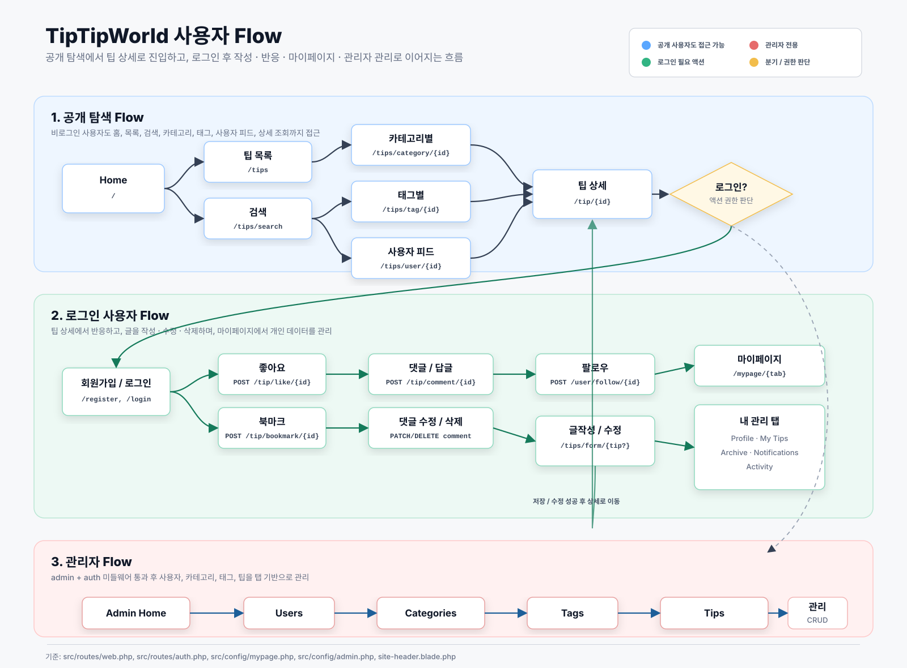

# TipTipWorld 유저 플로우 (코드 기반)

요청하신 대로 **이미지 형태의 유저 플로우**를 먼저 제공합니다.

## 이미지 설명 (요약)

- 로그인 상태 체크를 기준으로 **비로그인/로그인** 플로우가 분기됩니다.
- 비로그인은 조회 중심(홈, 팁목록/검색/상세, 유저피드)이고, 상호작용 기능은 로그인으로 유도됩니다.
- 로그인 사용자는 글 작성·수정, 좋아요/북마크, 댓글, 팔로우, 마이페이지/프로필 관리로 확장됩니다.
- 관리자 권한이 있으면 별도 **관리자 대시보드(Users/Categories/Tags/Tips 관리)** 로 진입합니다.
- 접근 규칙: `auth`, `admin` 미들웨어 및 팁 상세 공개 조건(`published` + `public`)을 반영했습니다.

## 원본(텍스트) 다이어그램이 필요하면

기존 Mermaid 버전도 필요하면 별도 파일로 다시 추가해드릴 수 있습니다.
